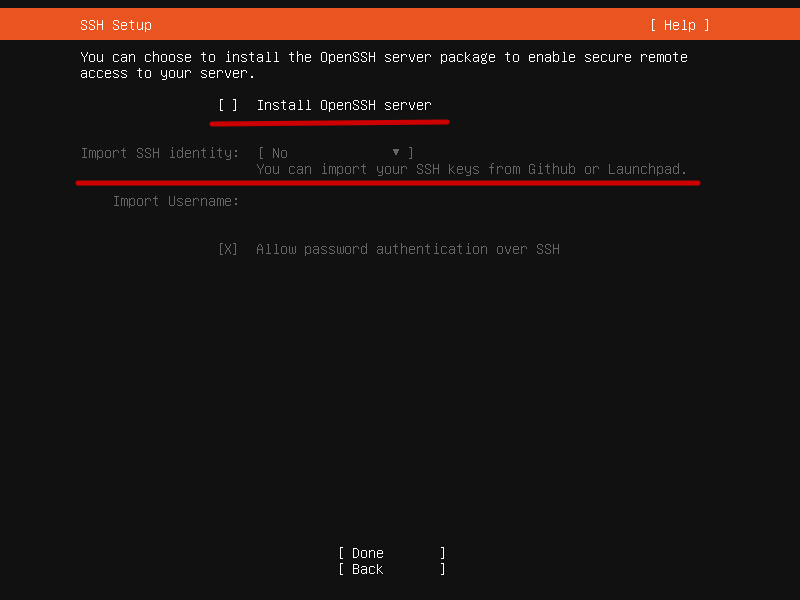

[](https://github.com/przemekgorzynski/Home_Infra/actions/workflows/yamllint.yml)
# Home_Infra
Home infrastructure configuration

# Prerequisites

- Install locally Bitwarden CLI

    `https://bitwarden.com/help/cli/`

- Install locally OS packages
    - sshpass
    - ansible

- Genrate Bitwarden API key and export as env variable (Account Settings -> Security -> Keys -> API Key)
    ```
    export BW_CLIENTID=username
    export BW_CLIENTSECRET=password
    ```

- You have locally generated SSh key-pair and this key is uploaded to GitHub account - will be fetched during OS installation
# Server Instalation

During installation process install OpenSSH server and import ssh keys from your GitHub account. 

It will be used for ansible authentication.



# Renovate

https://docs.renovatebot.com/configuration-options/

Local test command
```
sudo apt install renovate
LOG_LEVEL=info renovate --platform=local --repository-cache=reset
```

```json
{
  "$schema": "https://docs.renovatebot.com/renovate-schema.json",
  "enabled": true,
  "dependencyDashboard": true,
  "ignoreUnstable": true,
  "ignoreDeprecated": true,
  "prHourlyLimit": 10,
  "baseBranches": ["main"],
  "labels": ["renovate"],
  "automerge": false,
  "pinDigests": true,
  "prConcurrentLimit": 3,
  "prCreation": "immediate",
  "separateMajorMinor": true,
  "separateMinorPatch": true,
  "schedule": "0 10 * * 6",
  "timezone": "Europe/Warsaw"
}
```

# BitWarden unlock

```
bw login --apikey
```

```
bw unlock
```

```
bw sync
```

```
export BW_SESSION=XXXXX
```

# Base Config

```
ansible-galaxy collection install -r requirments.yml
```

```
ansible-playbook -i inventory.yml playbook_base_config.yml 
```

# Software config
```
ansible-playbook -i inventory.yml playbook_software_config.yml 
```