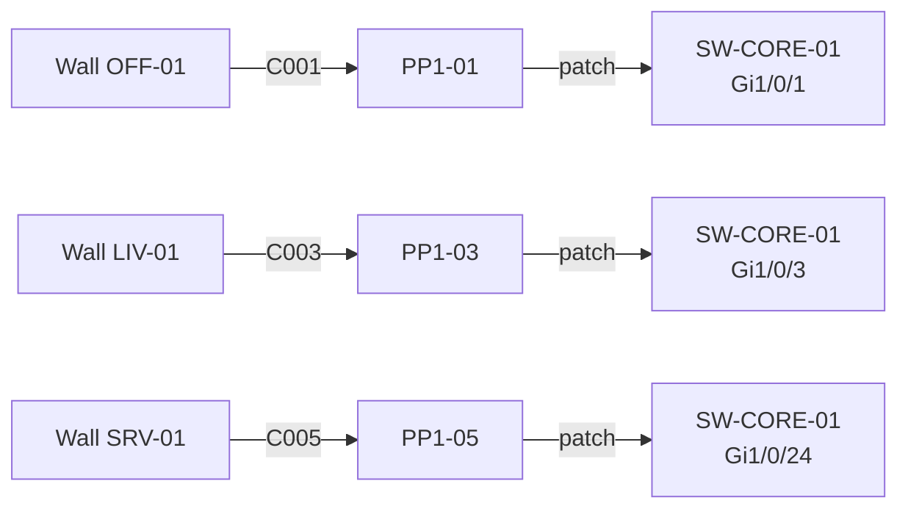

```mermaid
flowchart LR
    WP1[Wall OFF-01] -- C001 --> PP1[PP1-01]
    WP2[Wall LIV-01] -- C003 --> PP2[PP1-03]
    WP3[Wall SRV-01] -- C005 --> PP3[PP1-05]
    PP1 -- patch --> SW[SW-CORE-01<br/>Gi1/0/1]
    PP2 -- patch --> SW2[SW-CORE-01<br/>Gi1/0/3]
    PP3 -- patch --> SW3[SW-CORE-01<br/>Gi1/0/24]
```
